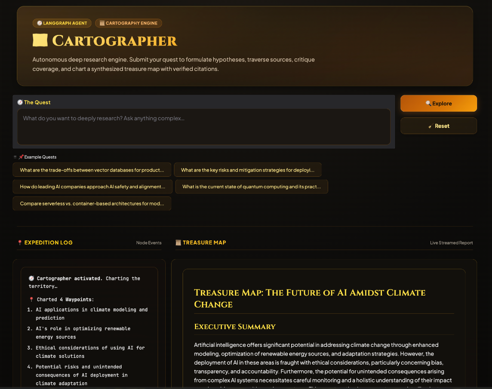

# Cartographer 🗺️ — Deep Research Agent

> *"Submit your Quest. Receive the Treasure Map."*



A domain-agnostic deep research agent that autonomously plans, searches, critiques, and synthesizes web knowledge into a cited research report.

## Project Summary

**Use Case:** Any open-ended research question (technology, policy, science, business)

**Theme:** Treasure hunt — the user submits a *Quest*, the agent returns a *Treasure Map*

**Stack:** LangGraph · LLM Model (swappable) · Tavily Search · Gradio · Python

---

## Quickstart

```bash
# 1. Install dependencies
pip install -r requirements.txt

# 2. Configure API keys
cp .env.example .env
# Edit .env with your GOOGLE_API_KEY and TAVILY_API_KEY

# 3. Run the notebook
jupyter notebook cartographer.ipynb

# 4. Or launch the Gradio UI directly
python cartographer_gradio.py
# Open http://localhost:7860
```

---

## Architecture

```
Quest → [Planner] → [Explorer] → [Critic] ──(gaps found)──► [Explorer]
                                           └──(coverage ok)─► [Writer] → Treasure Map
```

| Node | Alias | Role |
|---|---|---|
| Planner | "Chart the Territory" | Decomposes Quest into 3–5 Waypoints |
| Explorer | "Explore the Terrain" | Parallel Tavily searches per Waypoint |
| Critic | "Verify the Map" | LLM-as-judge scores coverage 0–10, identifies gaps |
| Writer | "Draw the Map" | Synthesizes cited Markdown report (streaming) |

### Re-expedition Loop
If `coverage_score < 7.0` AND `expedition_count < 2`, the Critic sends the Explorer back out targeting only the `uncharted_zones` identified. Max 2 re-expeditions.

---

## Configuration

All behaviour is controlled via `.env`:

| Variable | Default | Description |
|---|---|---|
| `CARTOGRAPHER_LLM_PROVIDER` | `google` | `google` \| `anthropic` \| `openai` \| `ollama` |
| `CARTOGRAPHER_LLM_MODEL` | `gemini-2.0-flash` | Model name within provider |
| `TAVILY_API_KEY` | — | Required. Get free tier at tavily.com |
| `MAX_EXPEDITIONS` | `2` | Max re-search iterations |
| `CRITIC_SCORE_THRESHOLD` | `7.0` | Score below which triggers re-expedition |
| `TAVILY_MAX_RESULTS` | `5` | Results per waypoint per search |

---

## Switching LLM Provider

```python
# In code — override defaults
from src.llm_factory import build_llm
llm = build_llm(provider='anthropic', model='claude-3-5-sonnet-20241022')

# Or via .env — zero code change
CARTOGRAPHER_LLM_PROVIDER=openai
CARTOGRAPHER_LLM_MODEL=gpt-4o-mini
OPENAI_API_KEY=sk-...
```

---

## Streaming

The Writer node uses a streaming LLM (`streaming=True`). The Gradio UI and Jupyter notebook both consume `graph.astream_events(input, version="v2")`:

- **Expedition Log** updates after each node via `on_chain_end` events
- **Treasure Map** streams tokens live via `on_chat_model_stream` events (filtered by `metadata["langgraph_node"] == "writer"`)

---

## Evals

```bash
jupyter nbconvert --to notebook --execute evals/eval_runner.ipynb --output evals/results/run.ipynb
```

5 curated test cases across diverse domains. Each is scored by an LLM-as-judge across 5 weighted dimensions (breadth, depth, recency, source diversity, citation quality).

---

## File Structure

```
deep-research/
├── cartographer.ipynb          Main notebook (walkthrough + full run)
├── cartographer_gradio.py      Gradio streaming UI
├── requirements.txt
├── .env.example
├── src/
│   ├── state.py                CartographerState TypedDict
│   ├── llm_factory.py          Provider-agnostic LLM factory
│   ├── graph.py                LangGraph StateGraph
│   ├── nodes/
│   │   ├── planner.py
│   │   ├── explorer.py
│   │   ├── critic.py
│   │   └── writer.py
│   └── tools/
│       └── search.py           Tavily async parallel search
└── evals/
    ├── test_cases.json
    └── eval_runner.ipynb
```
