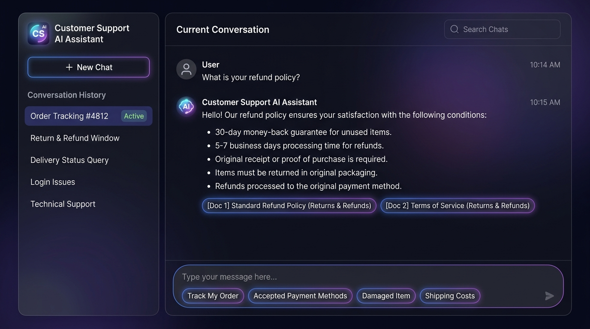

# Beacon Customer Support AI Agent (RAG + LangChain + Gemini)

A production-grade, eval-backed **Beacon Customer Support AI Agent** featuring Retrieval-Augmented Generation (RAG) built with **LangChain.js**, **Google Gemini**, and a lightweight **Preact** frontend.



---

## 🌟 Key Architecture & Production-Ready Engineering

### 1. Vendor-Agnostic Model Layer
- Uses LangChain's universal `initChatModel()` abstraction in [`src/modelFactory.ts`](src/modelFactory.ts), allowing dynamic switching between providers (`google-genai`, `openai`, `anthropic`) without altering core orchestration logic.
- Model instance is configured as a singleton with bound token limits (`maxTokens: 250`) and low temperature (`0.2`) to ensure concise, fact-grounded responses.

### 2. Embeddings & Vector Store
- Vector retrieval built on `@langchain/google-genai` (`GoogleGenerativeAIEmbeddings`) and `MemoryVectorStore`.
- Pre-indexes Bitext knowledge documents across order management, cancellations, returns & refunds, payment methods, shipping, and account privacy.

### 3. Session Management & Memory Isolation
- In-memory conversation state mapped per session ID with a sliding-window buffer (last 10 messages) to prevent context exhaustion and token bloat.
- RESTful session API for instant conversation switching, deletion, and new chat initialization.

### 4. Security & Guardrails
- **Input Constraints**: Client and server character boundary validation (max 200 chars per message).
- **API Rate Limiting**: Express rate-limiting on `/api/chat` to protect LLM quota from burst abuse.
- **Scope & Prompt Injection Guard**: System instructions explicitly bound the assistant to support domains, rejecting coding requests, jailbreaks, and off-topic conversations.
- **Anti-Filler Style Rules**: Enforces direct, greeting-free responses without conversational fluff.

---

## 📊 Evaluation & Testing Framework

This repository includes a multi-tier testing and evaluation harness designed for continuous quality measurement:

```
tests/
├── evals/
│   ├── eval_dataset.json        # Curated single-turn ground truth benchmark
│   ├── retrievalEvaluator.ts    # Retrieval Hit Rate @ K & Mean Reciprocal Rank (MRR)
│   ├── generationEvaluator.ts   # LLM-as-a-Judge (CoT reasoning), Style & Behavior checks
│   └── runEvals.ts              # Automated runner generating Markdown & JSON audit reports
├── rag.test.ts                  # Fast CI smoke test for pipeline & schema contract
└── memory.test.ts               # Session isolation & memory buffer sliding tests
```

### Metrics Measured:
- **Retrieval Hit Rate @ K**: Verifies that ground-truth FAQ documents rank within top-$K$ candidates.
- **Mean Reciprocal Rank (MRR)**: Measures ranking quality and proximity of top answers to position 1.
- **Faithfulness / Groundedness (LLM-as-a-Judge)**: Step-by-step Chain-of-Thought audit checking whether every claim is supported strictly by retrieved context (zero hallucination).
- **Answer Relevance**: Verifies direct inquiry answering without conversational drift.
- **Style Adherence**: Programmatically asserts absence of generic filler greetings.
- **Fallback & Scope Adherence**: Verifies graceful fallback on out-of-domain queries and polite rejection on adversarial attacks.

---

## 🚀 Quickstart

### 1. Configure Environment (`.env`)
```env
API_KEY=your_gemini_api_key_here
PORT=3000
MODEL_PROVIDER=google-genai
CHAT_MODEL=gemini-3.6-flash
EMBEDDING_MODEL=gemini-embedding-001
RAG_TOP_K=3
```

### 2. Install Dependencies
```bash
pnpm install
```

### 3. Run the Development Server
```bash
pnpm dev
```
Visit **http://localhost:3000** in your browser.

---

## 🧪 Running Tests & Evaluations

| Command | Purpose |
| :--- | :--- |
| `pnpm test:rag` | **CI Smoke Test**: Rapid validation of LCEL chain, vector retrieval, and response schema. |
| `pnpm test:memory` | **Memory Test**: Validates multi-turn context retention, session isolation, and buffer sliding. |
| `pnpm run eval` | **Full Evaluation Benchmark**: Runs the single-turn test suite through LLM Judge and outputs full transcripts + reasoning reports. |

